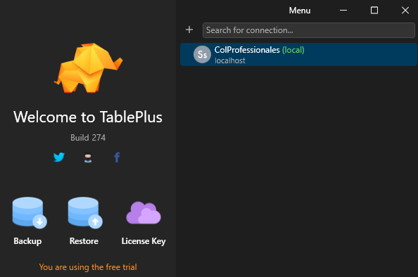
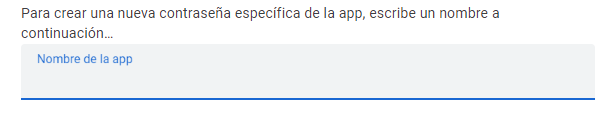

# Manual Técnico

Haga Click en la imagen para ir al video de muestra del sistema

## 1. Introducción:
Este documento describe el sistema local diseñado para gestionar y automatizar el registro de profesionales, tesis, y actividades relacionadas, así como la confirmación de asistencia y verificación de pagos en un contexto académico o profesional.

## 2. Descripción del proyecto:
El sistema permite el registro detallado de profesionales y tesis, almacenándolos en una base de datos. Genera cartas automáticas para enviar a los correos de los profesionales (tribunales) involucrados y maneja el registro de usuarios con diferentes roles y permisos.

## 3. Roles / integrantes:
- Devon Anderson Sandoval Berrios: Desarrollador Backend, gestión de base de datos y lógica del negocio.
- Maria Cristina Arrazola Candia: Desarrolladora Frontend, diseño de interfaz y experiencia de usuario.

## 4. Arquitectura del software:
Devon Anderson Sandoval Berrios y Maria Cristina Arrazola Candia	
Se utiliza ASP.NET Core 6 MVC como framework principal, siguiendo el patrón de diseño MVC (Model-View-Controller) para separar la lógica del negocio, la interfaz de usuario y el modelo de datos. La comunicación con la base de datos se realiza a través de modelos que facilitan la interacción con SQL Server 2019.

## 5. Requisitos del sistema:
- Cliente:
  - Requerimientos de Hardware (mínimo): Computadora con conexión a internet.
  - Requerimientos de Software: Navegador web actualizado (Chrome, Firefox, Safari).
- Servidor / Hosting / BD:
  - Requerimientos de Hardware: Servidor con al menos 8 GB de RAM y procesador de 4 núcleos.
  - Requerimientos de Software: Windows Server 2019, SQL Server 2019.

## 6. Instalación y configuración:
Resumen de instalacion con los archivos y link con programa que necesita :
1 los archivos del github :
  - Carpeta migration 
  - docker-compose.yaml
  - entrypoint.sh(codigo de consola)
2 link de la imagen para colocarla en su docker (Local)
  - docker pull anderson807/proyectocolprofesionales:latest (coloque ese comando en un cmd para que la imagen se descargue en la pc) 
3 ahora procedemos a colocar el comando "Docker-compose up" para levantar el sistema (esto lo tiene que hacer en donde clono el sistema del gihub vea si estan los archivos con "ls" para verificar).
  
Ahora ya que se levanto el sistema usted tiene que ir al Microsoft Edge y colocar en el la url:
  -localhost:8080 (es por el lugar esta iniciando nuestro sistema)

  

ya que esta alli use las cuentas que estan proporcionadas esta en el manual

4 ya que tiene el sistema corriendo si desea ver los datos que tiene la base de datos y verificarlo descargue TablePlus:
  - https://tableplus.com/download (este es un cliente donde podra entrar a la base de datos que hostea el docker donde esta corriendo con los datos )
Cuando lo instale e inicie el programa le saldra una pantalla como en la imagen:

ahora que esta en el menu apriete el simbolo de ( + ) y aparecera un formulario donde tendra que rellenar ,tiene que colocarlo igual que en la imagen :

el password es : Passw0rd (por si se pregumta el password abajo del User)

cuando ya tenga todo en orden pruebe con el Boton "test" para verificar si el sistema ya se levanto pero si dice algo raro como "Error" o algo es por que el sistema aun no se levanta . 
Espere y en un minuto

En el la parte de conexión colocar el nombre del Servidor  en el archivo appsettings.json , como ejemplo: "DefaultConnection": "Server=localhost;Database=DBColProfessional;User Id=sa;Password=Passw0rd;".
En la parte de “Server” colocar el nombre del servidor o caso que este en otra computadora la IP , ya que se utiliza Docker en el archivo Docker-composer.yaml tenemos la imagen del proyecto que es “(nombre_de_usuario)/proyectocolprofesionales” y “sqlserver” que es la base de datos en ese caso colocamos el nombre de la base en el “Server” de la conexión tambien colocar la contraseña y el user ya que en la imagen de la base de datos descargamos el SQl server así que se necesitara un user para restricción y seguridad de la base de datos.
Ahora las credenciales para envíos de correos GMAIL

"SmtpSettings": {
    "Server": "smtp.gmail.com",
    "Port": 587,
    "Username": "berriosanderson807@gmail.com",
    "Password": "scyvxwpafyihdgni",
    "Sender": "berriosanderson807@gmail.zcom"

Lo que necesitas para el envio del correo es el nombre del correo que uses como ves es “berriosanderson807@gmail.com” y la contraseña tambien colocar que correo lo enviara “berriosanderson807@gmail.com” para obtener la contraseña generada y que funcione necesitas ir a la cuenta de Gmail que usaras en el sistema y al apretar en tu imagen de perfil y ve a administración de cuenta

  
Luego en el buscador  colocas aplicación la primera opción colocas la primera opción como en la imagen
  

Entonces te parecera para ingresar el nombre de tu app lo crear

 y te aparecerá un texto del cual tienes que copiar y pegarlo en las credenciales del archivo appsettings.json y en el “Docker-compose.yaml” tienen que estar iguales para que la imagen lo pueda usar 
ya que tiene el archivo “ docker-compose.yaml y la carpeta migration con 2 los archivos .sql y entrypoint.sh  puede usar el comando “docker-compose up”  para levantar el sitio en “localhost:8080” y cuando se tenga que apagar ”docker-compose down“ esto hará que se apague los contenedores y que ya no se use la imagen del proyecto y la base de datos que se usan .

Funcionamiento del proyecto con Docker:
para el uso del programa usando docker es docker-compose up , eso hará que levante el proyecto entonces debe ir al “localhost:8080:80” para eso debe tener los siguientes archivos 

 
La carpeta migration es donde se aloja los 2 archivos 
db.sql crear la base y migration.sql que hace la creación de toda la base de datos con sus tablas relaciones y insersiones de una base limpia .
Docker-composer.yaml es un archivo de manejar las imágenes tanto como del proyecto cono la base de datos usualmente se llama “ orquestador “ y el entrypoint.sln es para el manejo de la creación de la migration de db.sql y migration.sql

Roles predefinidos en el sistema:
•	Principal | contraseña : 61793585
•	Secundario | contraseña : 84681392

Este rol es para técnicos esta por encima de los demás roles 
-	Tecnico | 9764
 
## 7. PROCEDIMIENTO DE HOSTEADO / HOSTING (configuración)
- sitio web local de contenedor Docker
- B.D.: Configuración y despliegue de SQL Server en contenedor docker

## 8. GIT:
- Versión final entregada del proyecto.
Use en el visual estudio code en la terminal en View -> Terminal ir a la carpeta que estará el proyecto o abrirlo directamente en el vi “ git clone https://github.com/CB-Proyecto-Sistemas-II-2024/PR-24-COL-PROFESIONALES/tree/Devon-Anderson “
- Entrega de compilados y ejecutables. 
## 9 Dockerizado Del Sitio WEB, de la Base de Datos:

Proceso de dockerización y configuración.
Primeramente tienes que tener encuenta el Docker-compose 
Al tener el dockerfile tienes la imagen y que este en junto con el .sln que es para entrar en el proyecto.
Cuanto tengas tus cambios en el proyecto tienes que hacer imagen los comandos que se tienen en el Makerfile , “build” creación de la imagen => luego hacer “Tag” que es nombrar marcar la imagen “docker tag proyectocolprofesionales anderson807/proyectocolprofesionales:latest “ el comando es Docker tag proyectocolprofesionales  es seleccionar la imagen que creaste lo que nombraste ,anderson807/proyectocolprofesionales:latest  es nombrar la imagen que tenias con el usuario que se buscara  y la imagen que buscas ,
Ahora  que tienes la imagen marcada y tengas tu Docker logeado , puedes usar Docker login o logearte con el desktop .
Después de loguearte usas el comando Docker push anderson807/proyectocolprofesionales:latest para subirlo al repositorio 

## 10 Personalización y configuración:
Modificación de archivo appsettings.json con las diferentes credenciales que te pide tambien se tiene que modificar en el Docker-compose.yaml

 ASPNETCORE_ENVIRONMENT=Development
      - ConnectionStrings__DefaultConnection=Server=sqlserver;Database=DBColProfessional;User Id=sa;Password=Passw0rd;
      - SmtpSettings__Server=smtp.gmail.com..0
      - SmtpSettings__Port=587
      - SmtpSettings__Username=berriosanderson807@gmail.com
      - SmtpSettings__Password=pihppzbxtandkssh
      - SmtpSettings__Sender=berriosanderson807@gmail.com
 ports:
      - "8080:80"
  
  sqlserver:
    image: mcr.microsoft.com/mssql/server:2019-latest
    
    environment:
    
      SA_PASSWORD: "Passw0rd"
      ACCEPT_EULA: "Y"
    ports:
      - "1433:1433"

Y 
En este seria en el appsettings.json
  "DefaultConnection": "Server=localhost;Database=DBColProfessional;User Id=sa;Password=Passw0rd;"
  },
  "SmtpSettings": {
    "Server": "smtp.gmail.com",
    "Port": 587,
    "Username": "berriosanderson807@gmail.com",
    "Password": "pihppzbxtandkssh",
    "Sender": "berriosanderson807@gmail.com"

### Personalizacion del proyecto:
    Fontend: eso se encuentran en las Vistas en la carpeta "Views" y esta separada en carpetas de cada vista 
    Backend: se encuentra en los controllers en ellos se encuentra las insersiones(Create y Read , delete(logicamente))
        Para el correo y la encriptacion de la contraseña esta en la carpeta Recursos :
            - las utilidades es donde se encripta la contraseña 
            - para la interface que se usan esta en Servicios/Contrato 
            - la imprementacion esta en la carpeta implementacion Implementacion
    

## 11 Seguridad:
Recomendaciones sobre cómo asegurar el software y los datos, incluyendo sistemas de autenticación robustos, encriptación de datos y manejo seguro de sesiones y accesos.
•	Autenticación y Autorización:
o	Utilizar ASP.NET Core Identity para gestionar la autenticación y autorización.
o	Implementar autenticación de dos factores (2FA) para añadir una capa adicional de seguridad.
o	Configurar políticas de contraseñas robustas y almacenar contraseñas utilizando hashing seguro (por ejemplo, bcrypt).
•	Encriptación de Datos:
o	Asegurar que todos los datos sensibles almacenados en la base de datos estén cifrados.
o	Utilizar HTTPS para encriptar la comunicación entre el cliente y el servidor.
o	Gestionar las claves de encriptación de manera segura, utilizando servicios de gestión de claves (KMS) si es posible.
•	Manejo Seguro de Sesiones:
o	Configurar cookies de sesión con los atributos HttpOnly, Secure, y SameSite.
o	Implementar timeouts de sesión y expiración de cookies para sesiones inactivas 3 minutos.
o	Validar y sanear todas las entradas de usuario para proteger contra ataques de inyección SQL y Cross-Site Scripting (XSS).
## 12 Depuración y solución de problemas:
•	Identificación de Problemas:
o	Utilizar herramientas de logging como Serilog o NLog para registrar errores y eventos importantes.
o	Configurar ASP.NET Core para mostrar detalles de errores en entornos de desarrollo mientras se ocultan en producción.
o	Implementar monitoreo de aplicaciones usando herramientas como Application Insights para rastrear el rendimiento y detectar anomalías.
•	Solución de Problemas Comunes:
o	Revisar los registros de errores para identificar patrones o problemas recurrentes.
o	Utilizar el depurador de Visual Studio para ejecutar el código paso a paso y analizar el flujo de ejecución.
o	Aislar y reproducir el problema en un entorno de desarrollo para facilitar su análisis y resolución.
Docker 
o	Si tiene algún problema con el dockerizado primero haga la imagen luego en TAG obrigatoriamente por que no funcionara la imagen para subirlo al contenedor publico en docker el ejemplo esta en ”Makefile”
o	Revise si tiene la imagen con el comando “docker images” 
## 13 Glosario de términos:
Definiciones de términos técnicos y conceptos utilizados en el manual y el proyecto.
•	ASP.NET Core: Un framework de desarrollo web de código abierto y multiplataforma desarrollado por Microsoft.
•	MVC: Modelo-Vista-Controlador, un patrón de diseño que separa la aplicación en tres componentes principales.
•	Identity: Un sistema de autenticación y autorización para aplicaciones ASP.NET Core.
•	2FA: Autenticación de dos factores, un método de confirmación de la identidad del usuario mediante la combinación de dos componentes diferentes.
•	HTTPS: Protocolo de transferencia de hipertexto seguro, una extensión de HTTP para la comunicación segura a través de una red.
•	Entityframework: Herramienta de manejor de clases para la conexión de base de datos con el paquete Entityframework.sql
## 14 Referencias y recursos adicionales:
Video de refencia para hacer login(https://www.youtube.com/watch?v=x0MBbx7lym8&t=398s)
Creacion de las clases y dbcontext con el uso de Entityframework(Scaffold-DbContext "Server=; Database= ;User=sa; Password= ; Trusted_Connection=true; Encrypt=False;" Microsoft.EntityFrameworkCore.SqlServer -d -ContextDir Data -OutputDir Models)
Entityframework versión 6.11 para el soporte de core 6 
Uso de mapa Bing (https://learn.microsoft.com/es-es/aspnet/web-pages/overview/ui-layouts-and-themes/displaying-maps-in-an-aspnet-web-pages-site)

## 15 Herramientas de Implementación:
•	Para la plantilla del proyecto(Lenguajes de programación: C#, JavaScript.)
•	Logica del proyecto(Frameworks: ASP.NET Core 6 MVC.)
•	 Servicio de terceros: servicios de correo electrónico de Google, uso de mapa con Bing
## 16  Bibliografía:
•	"Pro ASP.NET Core 6" por Adam Freeman.
•	Documentación oficial de ASP.NET Core: https://docs.microsoft.com/en-us/aspnet/core/?view=aspnetcore-6.0
•	Videos de youtube como ser : https://www.youtube.com/watch?v=x0MBbx7lym8&t=398s
•	Mapa de Bing : https://learn.microsoft.com/es-es/aspnet/web-pages/overview/ui-layouts-and-themes/displaying-maps-in-an-aspnet-web-pages-site

